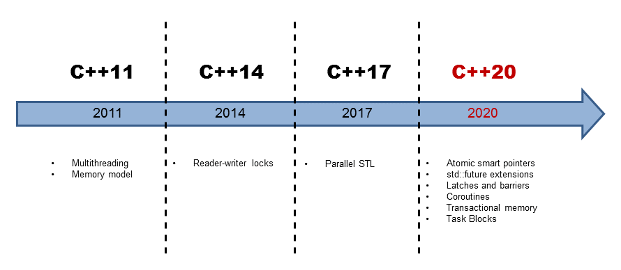

# 

## Concurrency in modern C++  

This repository contains a list of small experiments for **modern c++ concurrency**.

## The basics

These experiments address **basic questions** such as :
  - [What are the possible ways to build a thread ?](build-and-args-threads.cpp)
  - [How to pass parameters to a thread ?](build-and-args-threads.cpp)
  - [How to transfer the ownership of a thread ?](transfer-ownership-threads.cpp)
  - [What are the useful operations on threads ?](useful-operations-threads.cpp)
  - [Ensure single execution in multithreaded context ?](multithread-single-exec.cpp)
  - ...

## Some tests on more advanced topics

It should also provide sample code examples for _more advanced_ topics such as :
  - [RAII Thread wrapper](raii-thread-wrapper.cpp)
  - [Thread-safe Cout wrapper](thread-safe-cout-wrapper.cpp)
  - Communication between threads...
    - [using mutex and condition_variable](basic-threads-com.cpp)
    - [using promise and shared_future](advanced-threads-com.cpp)
  - [Thread-safe Stack : Access to shared data and locking mechanisms](basic-thread-safe-stack.cpp)
  - [Thread safe queue : Using condition_variables](thread_safe_queue_example.cpp)
  - [Background tasks using std::async](std-async-example.cpp)
  - [Usage of std::packaged_task](std-packaged-task-basics.cpp)
  - Lock-based thread-safe data structures and algorithms
  - Lock-free thread-safe data structures and algorithms
  - ...

## The latest features

I will also try to understand the **enhancements of the latest c++ standards** C++17/C++20.

  - [STL algorithms execution policy](stl-algorithms-policies.cpp)

## Ressources

This repository is highly inspirated by books and online ressources such as :
  - [**C++ concurrency in action**](https://www.manning.com/books/c-plus-plus-concurrency-in-action).
  - [**Effective Modern C++**](https://www.oreilly.com/library/view/effective-modern-c/9781491908419/).
  - [**Effective C++**](https://www.eyrolles.com/Informatique/Livre/effective-c--9780321334879/).
  - [**C++17 in detail**](https://leanpub.com/cpp17indetail?utm_source=blog&utm_campaign=adside)

Of course, the ressources used will be quoted in each sample code.

 
